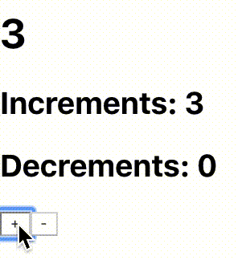

# Most-Basic-React-Context

This project was bootstrapped with [Create React App](https://github.com/facebook/create-react-app).

Also, have a look at the [React-Redux](https://react-redux.js.org/) version of the counter  - [Most-Basic-React-Redux](https://github.com/gpavanb1/Most-Basic-React-Redux)

## How To Run

In the project directory, using [`npm`](https://nodejs.org/en/), you can run:

### `npm start`

Runs the app in the development mode. 
Open [http://localhost:3000](http://localhost:3000) to view it in the browser.

The page will reload if you make edits. 

## Sample

## Contents

Relevant code is present in [App.js](./src/App.js). The code is divided into 3 sections and illustrates the core patterns of React's Context API.

* Context: The score along with increment and decrement functions are going to be stored in __ScoreContext__ in [context.js](./src/context.js)
* Two main components
	- __ScoreBoard__ : Stateless and displays main count stored in context, accessed through consumer and then looking at `score` property.
	- __Controller__ : Contains local states to track number of increments and decrements. Also, increment and decrement functions for global state are present in this. They are initialized in the `App` component and appropriately modify its state.
